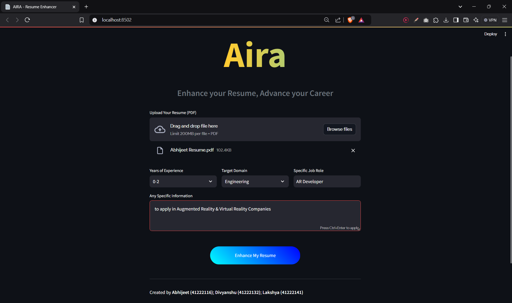
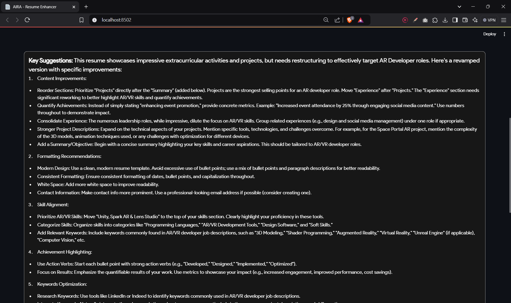

# AIRA - AI Resume Assistant

AIRA (AI Resume Assistant) is a Streamlit-based web application designed to analyze resumes and provide targeted suggestions for improvement using AI. With a focus on enhancing content, formatting, skill alignment, and more, AIRA is a powerful tool for crafting job-winning resumes.

---

## Features

### 🔍 Resume Suggestions
- Categorized feedback on:
  - **Content Improvements**
  - **Formatting Recommendations**
  - **Skill Alignment**
  - **Achievement Highlighting**
  - **Keywords Optimization**

### 🌟 Interactive Input Form
- Upload resumes in **PDF format**.
- Specify additional details like:
  - Target Job Role
  - Years of Experience
  - Skills, Certifications, Projects, and Career Goals
---

## Installation

### Prerequisites
Ensure you have the following installed:
- Python 3.8 or later
- Pip (Python package manager)

### Setup
1. Clone the repository:
   ```bash
   git clone https://github.com/your-username/aira-resume-assistant.git
   cd aira-resume-assistant
   ```

2. Install the required dependencies:
   ```bash
   pip install -r requirements.txt
   ```

3. Configure the Gemini API:
   - Replace `'YOUR_API_KEY'` in the `genai.configure()` function with your valid **Google Gemini API key**.

---

## Usage

1. Run the app locally:
   ```bash
   streamlit run app.py
   ```

2. Open the web app in your browser (default: [http://localhost:8501](http://localhost:8501)).

3. Use the interactive UI to:
   - Upload your resume in **PDF** format.
   - Enter additional information like skills, job role, and more.
   - View categorized suggestions.
   - Download the suggestions as a `.txt` file.
   
## Dependencies

Key libraries used in this project:
- **Streamlit**: For building the web interface.
- **PyPDF2**: For extracting text from PDF resumes.
- **Google Generative AI (Gemini)**: For generating AI-based suggestions.

---

## Screenshots

### Home Page


### Suggestions Output


---

## Contribution Guidelines

Contributions are welcome! To contribute:
1. Fork the repository.
2. Create a new feature branch.
3. Commit your changes.
4. Create a pull request.

---

## Authors

- **Abhijeet** (initator)
- **Divyanshu** (Co-coder)
- **Lakshya** (UI Design)

---

## License

This project is licensed under the MIT License. See the [LICENSE](LICENSE) file for details.

---

## Future Enhancements
- **Real-time Resume Scoring**: Analyze and display scores based on job role relevance.
- **Keyword Visualizations**: Generate graphs for better insights into keyword usage.
